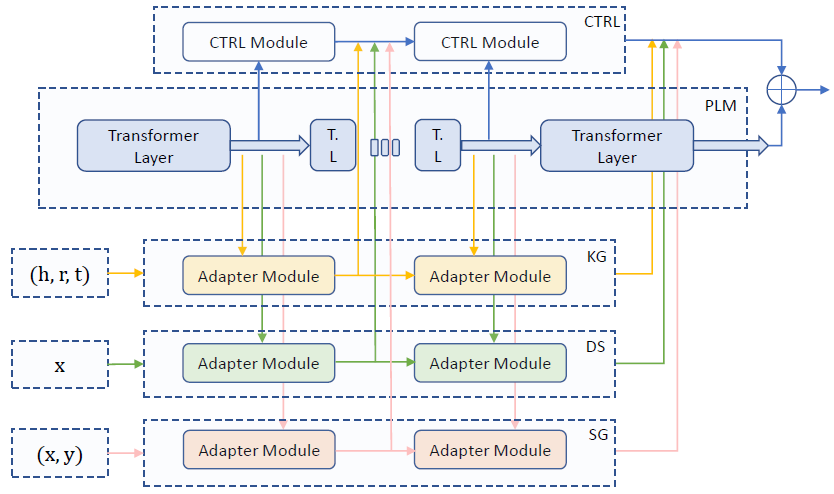

# Diverse Adapters for Knowledge Integration (DAKI)

This repository contains code and pre-trained knowledge adapters for the paper **"[Parameter-efficient domain knowledge integration from multiple sources for biomedical pre-trained language models](https://aclanthology.org/2021.findings-emnlp.325/) "**. The framework uses knowledge-specific adapters to enhance the performance of pre-trained language models (e.g., ALBERT, BERT, etc.) on biomedical NLP tasks. These adapters are pre-trained using different biomedical knowledge sources and can be integrated with BERT-like models in a parameter-efficient way.




_Figure: DAKI architecture._

## Repository Structure

- `MEDIQA-2019/`, `MEDNLI/`, `NCBI/`, `TRECQA-2017/`, `i2b2_2006/`  
  Contains dataset-specific evaluation scripts for different biomedical NLP tasks.
  
- `pretrained_adaptermodel/`  
  Pre-trained adapter models for knowledge sources like UMLS, Wikipedia diseases, and semantic groupings.

- `model.py`, `data.py`  
  Core model and data handling logic for training adapters.

- `train_disease.py`, `train_graph.py`, `train_sgrouping.py`  
  Scripts to pre-train adapters with different domain knowledge sources.

- `requirements.txt`  
  Dependencies needed to run the scripts.

## Installation

1. Clone this repository:
   ```bash
   git clone https://github.com/qiuhaolu/DAKI.git
   cd DAKI
   ```
2. Install dependencies:
   ```
   pip install -r requirements.txt
   ```
   
## Usage 

For each dataset, navigate to its corresponding directory and run the evaluation script:
```
cd MEDIQA-2019
python run_daki.py
```
You can equip various base PLMs with the pre-trained knowledge adapters.

## Pre-trained Adapters

Adapters are small neural networks that have been pre-trained on domain-specific knowledge sources such as:

- UMLS Metathesaurus
- Wikipedia Disease Articles
- Semantic Grouping for Medical Concepts

They are stored in `pretrained_adaptermodel/` and integrated into selective transformer layers during fine-tuning.

## Training New Adapters

To train adapters for new domain knowledge, you can refer to the following scripts as examples:

- `train_disease.py`
- `train_graph.py`
- `train_sgrouping.py`

## Acknowledgement

The evaluation scripts in this repository are adapted from [diseaseBERT](https://github.com/heyunh2015/diseaseBERT). We gratefully acknowledge their contributions, which have significantly aided the development of this project.

## References

If you find this code useful, please consider citing our works:

```bibtex
@inproceedings{lu2021parameter,
  title={Parameter-efficient domain knowledge integration from multiple sources for biomedical pre-trained language models},
  author={Lu, Qiuhao and Dou, Dejing and Nguyen, Thien Huu},
  booktitle={Findings of the Association for Computational Linguistics: EMNLP 2021},
  pages={3855--3865},
  year={2021}
}

@article{lu2024enhancing,
  title={Enhancing Clinical Relevance of Pretrained Language Models Through Integration of External Knowledge: Case Study on Cardiovascular Diagnosis From Electronic Health Records},
  author={Lu, Qiuhao and Wen, Andrew and Nguyen, Thien and Liu, Hongfang and others},
  journal={JMIR AI},
  volume={3},
  number={1},
  pages={e56932},
  year={2024},
  publisher={JMIR Publications Inc., Toronto, Canada}
}
```
